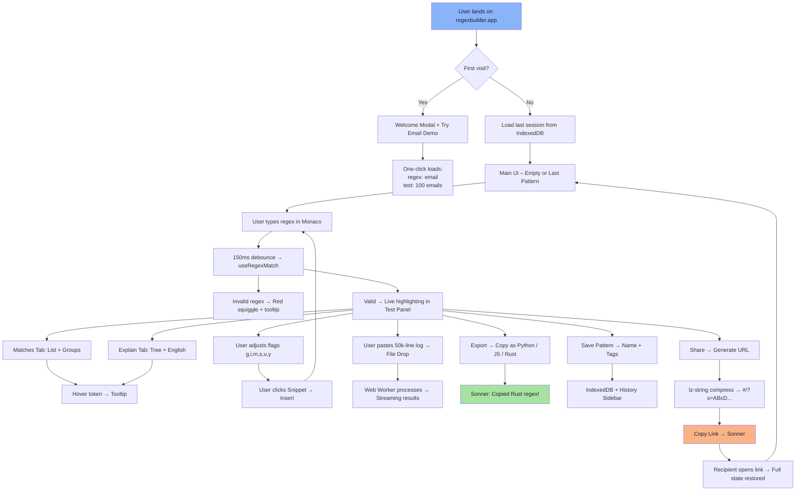
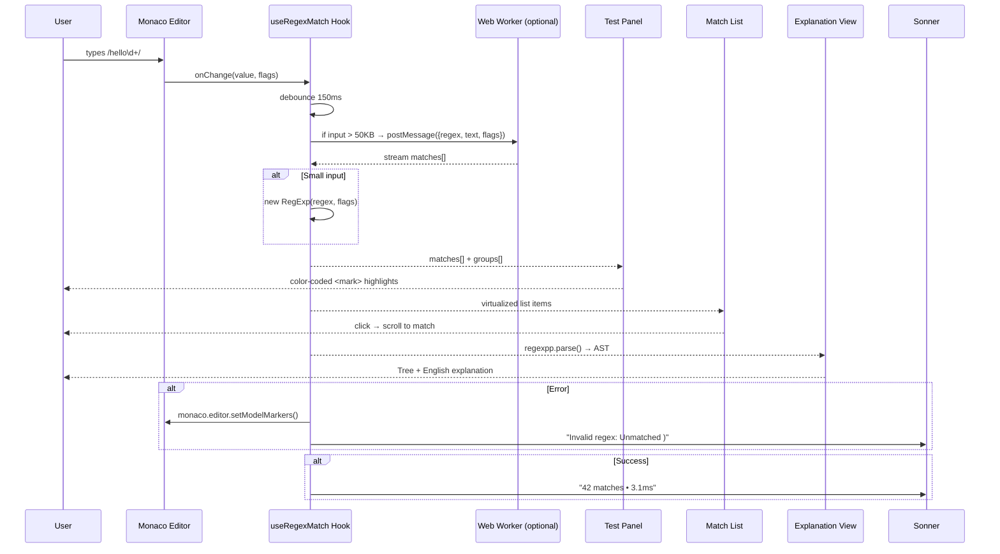
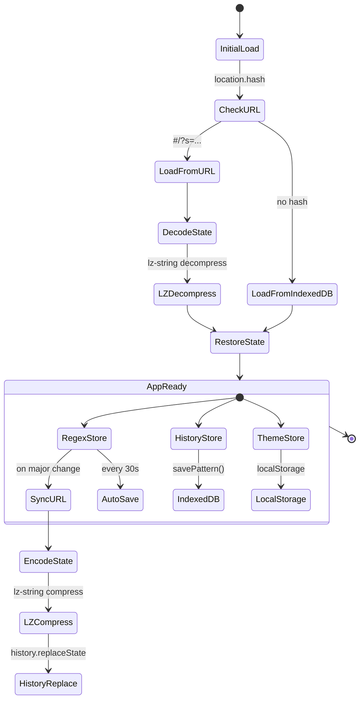
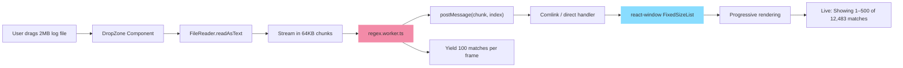
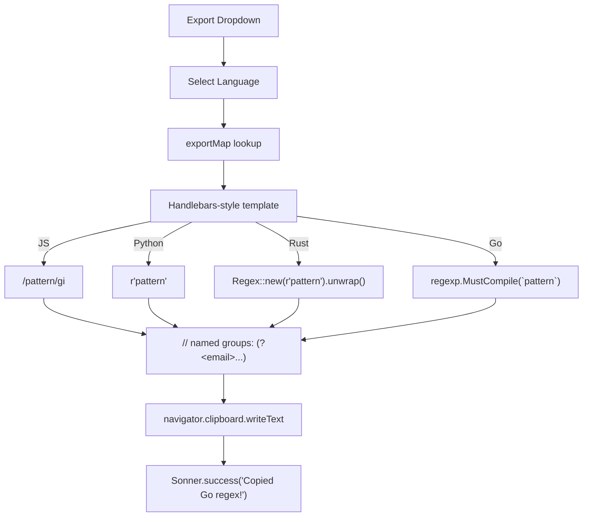
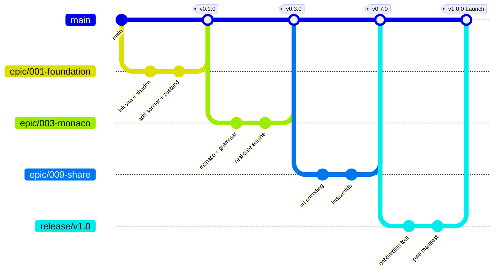

# Regex Builder – Visual Architecture & User Flow Diagrams  
**Document Version:** 1.0 (Mermaid.js – Fully Renderable in VS Code, Obsidian, Cursor, GitHub, Notion, HedgeDoc)  
**Compatible With:** Markdown renderers, Mermaid Live Editor: https://mermaid.live  

---

### 1. High-Level Architecture Diagram (C4 Level 2 – Component)

```mermaid
flowchart TB
    subgraph Browser["Browser (Chrome/Firefox/Safari)"]
        direction TB
        subgraph PWA["PWA Shell + Service Worker"]
            App["React App<br/>Vite + TypeScript"]
        end

        subgraph UI["UI Layer – shadcn/ui + Tailwind v4"]
            Header["Header + Theme Toggle"]
            Layout["Resizable 3-Panel Layout"]
            Tabs["Tabs: Matches | Explain | Snippets"]
            Monaco["Monaco Editor<br/>regex grammar"]
            TestPanel["Test Input + File Drop"]
            MatchViz["Match Highlighter"]
            MatchList["Virtualized Match List"]
            Tree["Explanation Tree View"]
            SnippetLib["Snippet Library + Search"]
            Export["Export Dropdown"]
            Sonner["Sonner Toasts"]
        end

        subgraph State["State Management – Zustand + Persistence"]
            ThemeStore["Theme Store"]
            RegexStore["Regex + Flags + Test Text"]
            HistoryStore["Saved Patterns (IndexedDB)"]
            SnippetStore["Snippet Cache"]
        end

        subgraph Core["Core Logic – Pure TS"]
            RegexEngine["useRegexMatch Hook<br/>(debounced + safe RegExp)"]
            Parser["regexpp → AST Parser"]
            Explainer["AST → Human Text"]
            Exporter["Multi-language Export Map"]
            URLCodec["lz-string Encoder/Decoder"]
        end

        subgraph Workers["Web Workers"]
            WW["regex.worker.ts<br/>Large-input matching"]
        end
    end

    %% External
    IndexedDB["IndexedDB<br/>idb-keyval"]
    Vercel["Vercel Edge + Analytics"]
    GitHub["GitHub<br/>snippets.json + Issues"]
    SWCache["Service Worker Cache"]

    %% Connections
    App --> UI
    UI --> State
    State --> Core
    Core --> RegexEngine
    RegexEngine <--> WW
    Core --> Parser
    Parser --> Explainer
    Core --> Exporter
    Core --> URLCodec
    State --> IndexedDB
    SnippetLib --> GitHub
    App --> Vercel
    PWA --> SWCache

    style Browser fill:#1e1e2e,stroke:#cdd6f4,color:#cdd6f4
    style PWA fill:#31324b,stroke:#89b4fa
    style Workers fill:#2b2d42,stroke:#f38ba8
    style IndexedDB fill:#45475a,stroke:#a6e3a1
    style GitHub fill:#45475a,stroke:#fab387
```

---

### 2. User Flow – Main Journey (Onboarding → Share)

---

### 3. Detailed Component Data Flow (Real-time Matching)

---

### 4. State Management Flow (Zustand + Persistence)

---

### 5. File Upload → Large Input Pipeline

---

### 6. Export System – Multi-language Pipeline

---

### 7. Deployment & CI/CD Pipeline

